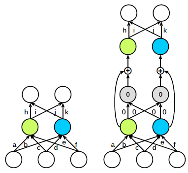

[](https://opensource.org/licenses/MIT)

# Neuro-Cell-based Evolution
A PyTorch Implementation for Neuro-Cell-based Evolution with Function-Preserving Mutations

This repository contains a [PyTorch](https://github.com/pytorch/pytorch) implementation of the paper [Deep Learning Architecture Search by Neuro-Cell-based Evolution with Function-Preserving Mutations](http://www.ecmlpkdd2018.org/wp-content/uploads/2018/09/108.pdf). 

|Skip connection |  Kernel widening|
:-------------------------:|:-------------------------:
  |  

## Usage
### Create a template model
We first need to determine which template model to use. Take the CIFAR10 dataset for example, we can create a template model (architecture) like this:

| Template model |
|-------------------------|
||

with the following code:

```
base_model_tuple = create_base_model(num_cells=3, input_dim=32, num_classes=10, \
                                     dropout_conv=0.7, dropout_fc=0.5)
```

where each parameter shoulde be fairly self-explantory, and the dimension of the flatten layer is given by:


### Prepare dataloaders
The Neuro-Cell-based method uses a hold out validation set during the evolution process. Upon the champion architecture is determined, it combines the training set and the validation set to construct a full training set on which the champion model is train. After the training is done, the champion model will be tested on the hold out test set.

Before passing the data into our training framework, we need to prepare a dataloader tuple like this:

```
dataloader_tuple = train_loader, valid_loader, full_train_loader, test_loader
```

### Use the Evo object to initiate the evolution
Now, to get the evolution started, we need to instantiate an Evo object:

```
e = Evo(base_epochs=63, mutation_epochs=15, ft_epochs=63, lr=0.05, init_size=INIT_SIZE)
```

where `base_epochs` is the number of epochs for which we train the original template model (teacher net); `mutation_epochs` for training each mutation (student net); `ft_epochs` for training the champion model.

We can then pass `base_model_tuple` and `dataloader_tuple` in to the function call:

```
evo_list, evo_param_list = e.evolve(base_model_tuple, dataloader_tuple=dataloader_tuple, num_generations=NUM_GENERATIONS, repeat=REPEATS)
```

We use `num_generations` to control how long the algorithm runs. The more generations the longer it would take, and `repeat` (defaults to 1) to control the number of experiments to run.

The figure below from the original paper shows how the performance of the mutations change over time.


### Example
We have written a simple example script for CIFAR10. To run the example, simply run:

```
python start_evolution.py
```

## Note
We use [SGD with Restarts](https://arxiv.org/abs/1608.03983) for each training where the learning rate can be adjusted with the instantiation of the Evo object. Though not specified in the paper of [Net2Net](https://arxiv.org/abs/1511.05641), a noise of magnitude of 10^-5 is applied to the widened layer to break symmetry for the layer widening mutation.

Our implementation tries to stick with the original paper as close as possible with the following difference:

* No layer branching support
* No depthwise separable convolution support

## To Do List
- [ ] Add multi-GPU support
- [ ] Add segmentation support

## Acknowledgements
The Cutout code is implemented by [uoguelph-mlrg](https://github.com/uoguelph-mlrg) [here](https://github.com/uoguelph-mlrg/Cutout)

## License
This repo is MIT licensed.